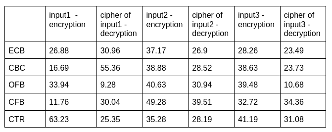

# AES Cipher

To measure the execution time, we generate 3 input messages. The first input contains 1494 bytes, the second one contains 1650 bytes and the last one contains 1355 bytes. We encrypt, decrypt 100 times each input, each mode and calculate the average execution time. The below table is represented in **microsecond** units.

